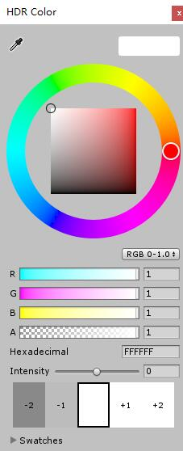
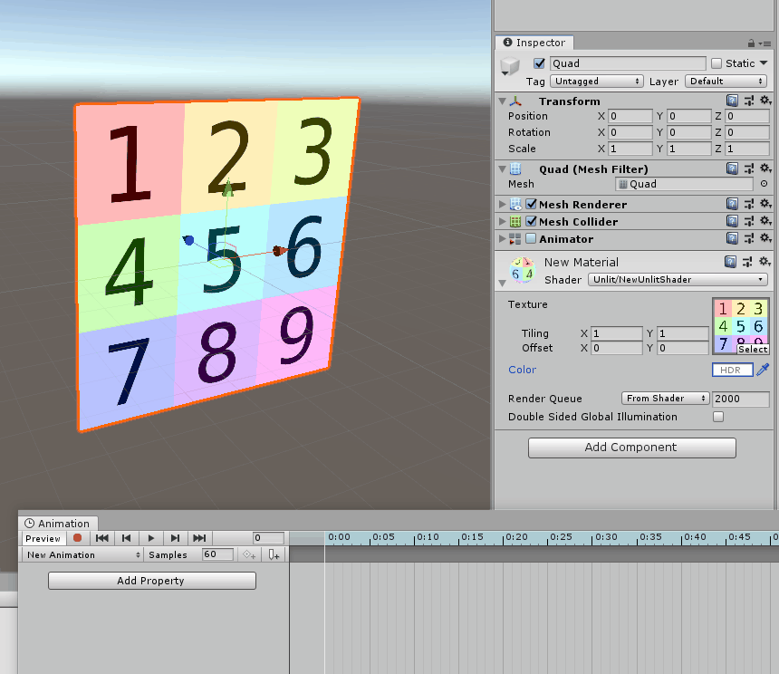
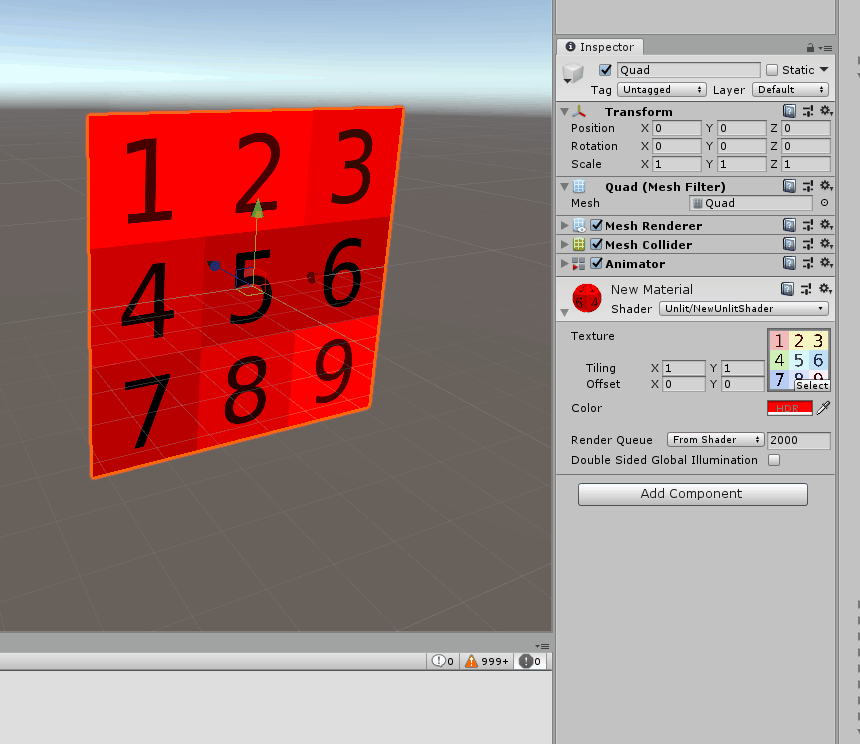
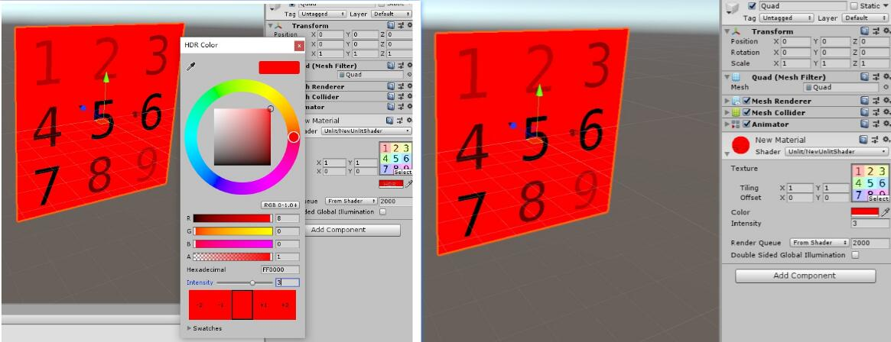
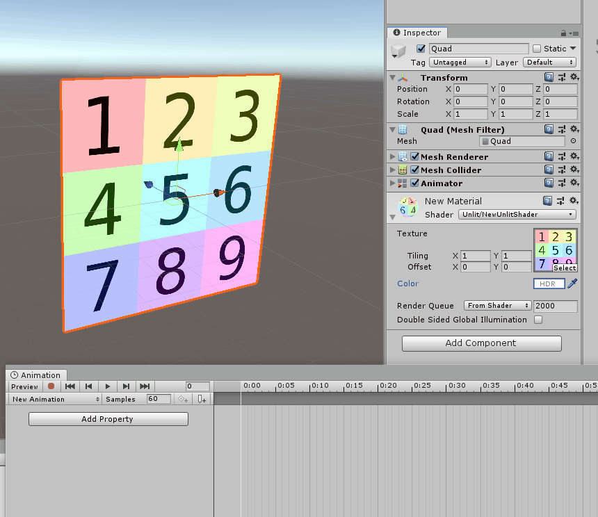

> 帮美术制作特效Shader时，美术反映了一个问题：在K动画时材质颜色会突然变化。一开始以为是Shader计算问题，后来才发现只要是HDR Color属性，在k动画时都会有这个问题，因此记录一下。

# HDR简介

普通Color的范围是[0,1]，HDR颜色亮度值可以超过1，通过这个值可以配合后期Bloom效果做出泛光效果。 

在Shader中设置：

```c
[HDR]_Color ("Color",Color ) = (1,1,1,1)
```

取色器是这样的：



# 问题描述

在Animation面板K动画时，如果设置了HDR颜色且Intensity不为0，则颜色会突然变化。如下图，使用UnlitShader并添加一个HDR Color属性：



当你关掉Animation时，颜色又突然恢复正常：


虽说这个问题只有在K动画时才出现，不影响正常材质表现，但显然会让美术在制作资源时受到困扰，因此还是需要想个办法避免这个问题。

# 分析研究

首先做个测试，分析下Intensity是如何影响颜色值的。



可以看到Intensity并不是线性影响颜色值的，根据调整Intensity时R值的变化，推测计算公式为$color = color * 2^{Intensity}$

修改Shader，使用普通Color，效果对比如下：



可以看到效果差不多，说明猜测正确。修改后可以正常K动画，不会出现颜色突变问题。

附测试Shader

```c
Shader "Unlit/NewUnlitShader"
{
    Properties
    {
        _MainTex ("Texture", 2D) = "white" {}
        _Color ("Color",Color ) = (1,1,1,1)
        _Intensity ("Intensity",Float) = 0
    }
    SubShader
    {
        Tags { "RenderType"="Opaque" }
        LOD 100

        Pass
        {
            CGPROGRAM
            #pragma vertex vert
            #pragma fragment frag
            // make fog work
            #pragma multi_compile_fog

            #include "UnityCG.cginc"

            struct appdata
            {
                float4 vertex : POSITION;
                float2 uv : TEXCOORD0;
            };

            struct v2f
            {
                float2 uv : TEXCOORD0;
                UNITY_FOG_COORDS(1)
                float4 vertex : SV_POSITION;
            };

            sampler2D _MainTex;
            float4 _MainTex_ST;
            float4 _Color;
            float _Intensity;

            v2f vert (appdata v)
            {
                v2f o;
                o.vertex = UnityObjectToClipPos(v.vertex);
                o.uv = TRANSFORM_TEX(v.uv, _MainTex);
                UNITY_TRANSFER_FOG(o,o.vertex);
                return o;
            }

            fixed4 frag (v2f i) : SV_Target
            {
                // sample the texture
                //fixed4 col = tex2D(_MainTex, i.uv)*_Color;
                fixed4 col = tex2D(_MainTex, i.uv)*_Color*pow(2,_Intensity);
                // apply fog
                UNITY_APPLY_FOG(i.fogCoord, col);

                return col;
            }
            ENDCG
        }
    }
}
```

# 其他疑问

虽说暂时解决了这个问题，但是并没有找到问题的原因。

测试过程中发现调整Intensity后，再打开取色器，Intensity值自动发生了变化，可能和unity内部实现机制有关。如果以后找到原因会再进行补充。

