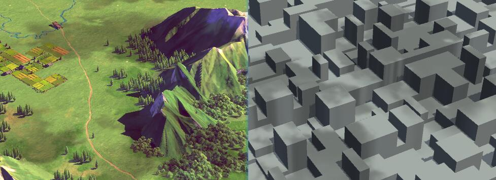
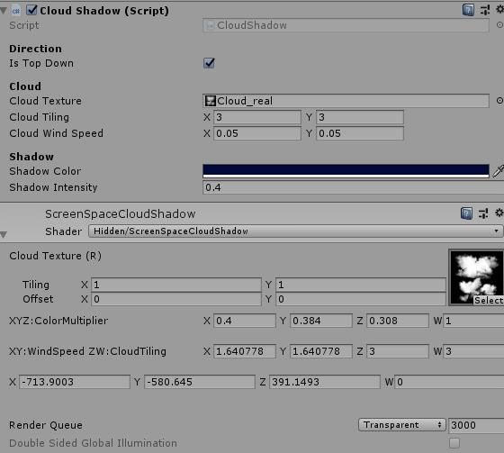
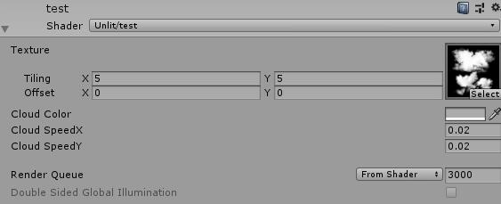

# Unity中云层投影效果实现

最近项目希望场景里出现云层投影，查阅资料后参考了这篇文章去实现效果：[Unity3D地面云层投影实时绘制](https://blog.csdn.net/jxw167/article/details/81564998)

达到的效果如下：



## 实现方案

实现类似效果主要有两种方案：

**方案一**

实现一个飘动的云层，通过平行光将其投射到地面上。

优点：

- 实现简单

缺点：

- 依赖unity内置shadow，无法单独改变阴影效果
- 需要实时灯光，云层真实移动，影响运行效率

**方案二**

使用与摄像机远裁剪面大小一致的平面，利用深度图渲染云投影到平面上，通过材质控制投影效果

优点：

- 可以自由控制投影效果

缺点：

- 根据shader计算复杂度，增加额外渲染消耗


就像参考文章中所说，云层投影无非就是考虑以下几方面效果：

1. 云层图案（纹理采样实现，大小可通过tilling值控制，颜色可通过颜色属性控制）
2. 云层移动（使用UV偏移实现）
3. 深度纹理（摄像机渲染深度纹理实现）

本文实现方式与参考文章一致，主要做了以下变动：

- 原文考虑了正交相机的情况，因为一般3D游戏使用透视相机，因此精简后去掉了脚本中相关代码和shader中的开关。
- 原文使用脚本传递值给shader，这一部分我觉得没有必要，需要考虑的效果都是可以直接在shader中设置的，不需要运行时改变，因此删掉了传值相关代码，减少不必要消耗。
- 原文的shader参数不直观，修改了shader计算，让面板更直观，方便美术直接操作。

未修改前面板：



修改后面板：



## 具体操作

1. 设置Camera的标签为MainCamera（这里脚本中使用MainCamera标签获取摄像机，可以修改方式，直接指定某个相机）
2. 在场景中添加一个Quad，挂上CloudShadow脚本（脚本主要是为了设置平面的位置、大小及旋转，设置好后可以直接remove脚本）
3. 给quad添加使用CloudShadow Shader的材质，设置材质属性

注意，如果显示效果不正确，可以检查下当前平台，检查摄像机是否开启深度渲染。

## 附script和shader

CloudShadowTest.cs:

```c#
using System.Collections;
using System.Collections.Generic;
using UnityEngine;

[ExecuteInEditMode]
[RequireComponent(typeof(Renderer))]
public class CloudShadowTest : MonoBehaviour
{
    private Renderer ObjRenderer = null;
    private Shader ObjShader = null;
    void Awake()
    {
        ObjRenderer = GetComponent<Renderer>();
        ObjShader = ObjRenderer && ObjRenderer.sharedMaterial ? ObjRenderer.sharedMaterial.shader : null;
        CheckSupport();
    }

    void CheckSupport()
    {
        if (!SystemInfo.supportsImageEffects || !SystemInfo.SupportsRenderTextureFormat(RenderTextureFormat.Depth))
        {
            Debug.LogWarning("ScreenSpaceCloudShadow has been disabled as it's not supported on the current platform.");
            enabled = false;
        }
        ObjRenderer.enabled = enabled;
        if (!ObjShader || !ObjShader.isSupported)
        {
            Debug.LogWarning("ScreenSpaceCloudShadow has been disabled as it's not support shader.");
            ObjRenderer.enabled = false;
            enabled = false;
        }
    }

    void Start()
    {
        OnWillRenderObject();
    }

    void OnEnable()
    {
        if (Camera.main)
            Camera.main.depthTextureMode |= DepthTextureMode.Depth;
    }


    void OnWillRenderObject()
    {
        Camera cam = Camera.main;
        float dist = cam.farClipPlane - 0.1f;
        Vector3 campos = cam.transform.position;
        Vector3 camray = cam.transform.forward * dist;
        Vector3 quadpos = campos + camray;
        transform.position = quadpos;

        Vector3 scale = transform.parent ? transform.parent.localScale : Vector3.one;
        float h = cam.orthographic ? cam.orthographicSize * 2f : Mathf.Tan(cam.fieldOfView * Mathf.Deg2Rad * 0.5f) * dist * 2f;
        transform.localScale = new Vector3(h * cam.aspect / scale.x, h / scale.y, 0f);

        bool isGameView = Camera.current == null || Camera.current == Camera.main;
        if (isGameView)
        {
            transform.rotation = Quaternion.LookRotation(quadpos - campos, cam.transform.up); 
        }
    }
}
```

CloudShadowTest.shader：

```c
Shader "Unlit/CloudShadowTest"
{
    Properties
    {
        _MainTex ("Texture", 2D) = "white" {}
        _CloudColor("Cloud Color", Color) = (1,1,1,1)
        _SpeedX("Cloud SpeedX", Float) = 0.05
        _SpeedY("Cloud SpeedY", Float) = 0.05
    }
    SubShader
    {
        Tags
        {
            "Queue"="Transparent"
            "IgnoreProjector"="True"
            "ForceNoShadowCasting"="True"
        }

        Pass
        {
            ZWrite Off 
            ZTest Always
            Blend Zero OneMinusSrcColor

            CGPROGRAM
            #pragma vertex vert
            #pragma fragment frag

            #include "UnityCG.cginc"


            struct v2f
            {
                float4 pos : SV_POSITION;
                float2 uv  : TEXCOORD0;
                float3 ray : TEXCOORD1;
            };

            sampler2D _MainTex;
            float4 _MainTex_ST;
            half4 _CloudColor;
            half _SpeedX;
            half _SpeedY;
            half4 _WorldSpaceCameraRay;

            sampler2D _CameraDepthTexture;

            v2f vert (appdata_base v)
            {
                v2f o;
                o.pos = UnityObjectToClipPos (v.vertex);
                o.uv = v.texcoord.xy;

                float3 pos_world = mul (unity_ObjectToWorld, v.vertex);
                o.ray = pos_world - _WorldSpaceCameraPos;
                return o;
            }

            fixed4 frag (v2f i) : SV_Target
            {

                float  depth = Linear01Depth( SAMPLE_DEPTH_TEXTURE( _CameraDepthTexture, i.uv ) );
                float3 world = i.ray * depth + _WorldSpaceCameraPos;

                float2 world_uv = world.xz;
                float2 cloud_uv = world_uv * 0.005f;
                cloud_uv = (cloud_uv + _Time.y * float2(_SpeedX,_SpeedY))* _MainTex_ST.xy;

                float cloud = tex2D(_MainTex, cloud_uv).r * (1 - depth);

                float4 col = float4((1 - _CloudColor.rgb)*cloud,1.0);

                return col;
            }
            ENDCG
        }
    }
}
```


