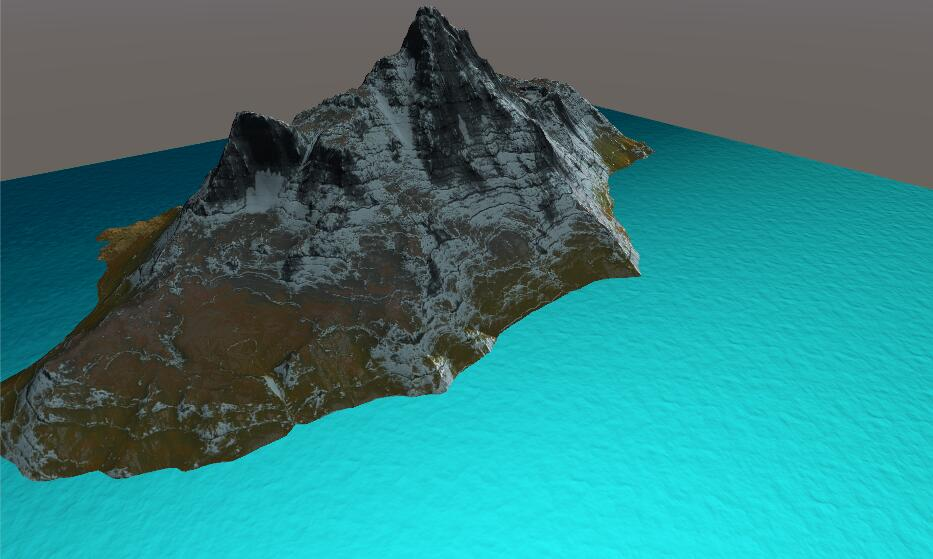
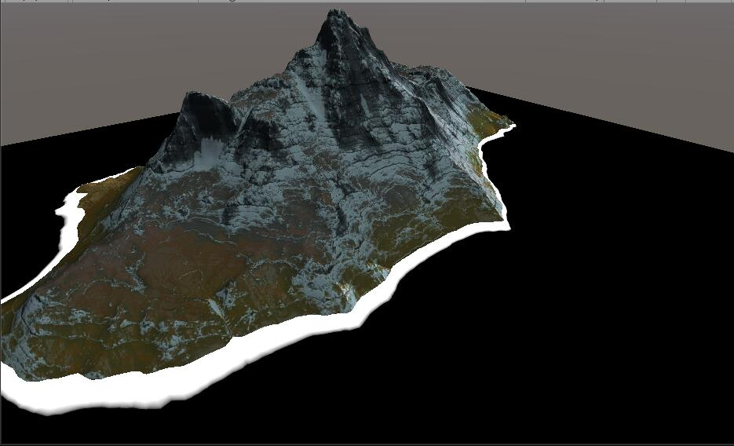

# Simple Water

> 在Unity中使用Shader实现水效果，基本功能有深浅颜色、水面波纹、高光、菲涅尔、边缘泡沫、细节扰动、顶点动画。

最终效果图


## 1.基本颜色

先来看基本颜色实现。水面一般受深浅影响，颜色会看起来不一样。实现方法就是使用色彩插值。理论上讲可以使用很多颜色插值，简单起见这里只分两个颜色。水面深浅图放在Foam贴图的R通道。Foam贴图RGB通道分别为深浅图、泡沫图、细节图，这样做主要是为了节省贴图，减少采样次数。从0-1对应从浅-深的颜色。核心代码如下：

```c
half degree = tex2D(_Foam,i.uv).r;
half4 diffuse = lerp(_ShalowColor, _DeepColor, degree);
```

此时效果如下：


更改贴图就可以有更丰富的深浅变化，我这里只是简单做了个渐变。与直接采样贴图颜色相比，省了一张RGB贴图，而且美术可以在材质中调节颜色值，而不用去修改贴图。这里uv比例是1:1，贴图大小是512×512。如果要有丰富的深浅变化，对贴图大小和精度要求会更高。

## 2. 水面波纹

水面波纹是水最核心的部分，最常用的做法是使用一张法线贴图做两层uv移动并混合。核心代码如下：

```c
half2 panner1 = ( _Time.y * _WaveParams.xy + i.uv);
half2 panner2 = ( _Time.y * _WaveParams.zw + i.uv);
half3 worldNormal = BlendNormals(UnpackNormal(tex2D( _WaterNormal, panner1)) , UnpackNormal(tex2D(_WaterNormal, panner2)));
worldNormal = lerp(half3(0, 0, 1), worldNormal, _NormalScale);
```

panner1和panner2控制uv偏移。WaveParams的xy和zw分别是水流速度1和速度2._NormalScale控制法线强度。

需要注意的是，原本的法线贴图是存储在切线空间的，法线值需要转换到世界坐标下。关于切线空间转世界空间，可以参考[这篇文章](https://blog.csdn.net/liu_if_else/article/details/73604356)。具体代码如下：

```c
v2f vert (appdata_full v)
{
    ...
    o.worldPos = mul(unity_ObjectToWorld, v.vertex);
    fixed3 worldNormal = UnityObjectToWorldNormal(v.normal);
    fixed3 worldTangent = UnityObjectToWorldDir(v.tangent.xyz);
    fixed tangentSign = v.tangent.w * unity_WorldTransformParams.w;
    fixed3 worldBinormal = cross(worldNormal, worldTangent) * tangentSign;
    o.TW0 = float4(worldTangent.x, worldBinormal.x, worldNormal.x, o.worldPos.x);
    o.TW1 = float4(worldTangent.y, worldBinormal.y, worldNormal.y, o.worldPos.y);
    o.TW2 = float4(worldTangent.z, worldBinormal.z, worldNormal.z, o.worldPos.z);
    ...
    return o;
}
fixed4 frag (v2f i) : SV_Target
{
    ...
    worldNormal = normalize(fixed3(dot(i.TW0.xyz, worldNormal), dot(i.TW1.xyz, worldNormal), dot(i.TW2.xyz, worldNormal)));
    ...
}
```

计算法线值的目的是用来进行光照计算，常见光照模型有Lambert、Blinn-Phong、PBR，也可以自定义光照模型。在这个例子里，高光部分使用了Blinn-Phong光照模型，具体计算后面会讲。Diffuse部分稍作了改变，原本的Diffuse计算需要的是NdotL，这里改为了NdotV，与视角有了一定关系。代码如下：

```c
fixed3 viewDir = normalize(UnityWorldSpaceViewDir(i.worldPos));
float NdotV = saturate(dot(worldNormal,viewDir));
...
diffuse *= NdotV;
```

此时效果如下，可以调整波纹速度、强度和大小（通过tiling值）：



## 3. 水面高光

水面高光能够体现出水波光粼粼的感觉，对于提升水的效果十分重要。这里使用Blinn-Phong的高光公式:
$$
h = normalize(v + l);\\
C_{specular} = C_{light} * specular * pow(max(0, dot(n, h), gloss));
$$
转化为代码如下：

```c
fixed3 halfDir = normalize(worldLightDir + viewDir);
fixed3 specular = _LightColor.rgb * _WaterSpecular * pow(max(0, dot(worldNormal, halfDir)), _WaterGloss);
```

其中_LightColor是光照颜色，waterSpecular是高光整体强度，waterGloss是高光系数。worldLightDir可以是自己定义的vector4，也可以直接获取场景中的主光 _WorldSpaceLightPos0 （局限性：如果场景中光照复杂，比如有多个平行光，则无法指定有效光照是哪个）。

最终输出diffuse.rgb+specular。

此时效果如下：


## 4. 菲涅尔效果

菲涅尔指的是反射/折射与视点角度之间的关系。如果你站在湖边，低头看脚下的水，你会发现水是透明的，反射不是特别强烈；如果你看远处的湖面，你会发现水并不是透明的，而且反射非常强烈。这就是“菲涅尔效应”。


简单的讲，就是视线垂直于表面时，反射较弱，而当视线非垂直表面时，夹角越小，反射越明显。如果你看向一个圆球，那圆球中心的反射较弱，靠近边缘较强。不过这种过度关系被折射率影响。注意，在真实世界中，除了金属之外，其它物质均有不同程度的“菲涅尔效应”。

根据定义可以使用NdotV来判断视线与表面的角度关系，NdotV值越接近1说明夹角越小。代码如下：

```c
fixed3 rim = pow(1-saturate(NdotV),_RimPower)*_LightColor * rimIntensity;
```

这个其实也是计算边缘光的公式。

对比效果如下，右边为添加了菲涅尔效果：


## 5. 边缘泡沫

边缘泡沫只产生在水面和其他模型交接的边缘。一般有两种做法，一是用通道图画出边缘。优点是可控性强，性能消耗低。缺点是边缘质量很依赖贴图大小和精度，一旦场景改变需要重制贴图；二是使用深度图直接检测出交接边缘。优点是精度较高，无需美术反复修改贴图。缺点是性能消耗略大（有些低端移动设备不支持渲染深度图或者默认不开启渲染深度图）。这里采用深度图做法。

除了摄像机要开启深度图渲染，shader中需要做以下工作。

声明深度纹理

```c
uniform sampler2D _CameraDepthTexture;
```

获取屏幕位置

```c
o.screenPos = ComputeScreenPos(o.vertex);
```

计算边缘区域

 ```c
half4 screenPos = float4( i.screenPos.xyz , i.screenPos.w);
half eyeDepth = LinearEyeDepth(UNITY_SAMPLE_DEPTH(tex2Dproj(_CameraDepthTexture,UNITY_PROJ_COORD( screenPos ))));
half eyeDepthSubScreenPos = abs( eyeDepth - screenPos.w );
half depthMask = 1-eyeDepthSubScreenPos + _FoamDepth;
 ```

depthMask就是最终得到的边缘区域图，添加FoamDepth是为了控制边缘区域的范围大小。



有了边缘区域接下来就是要让边缘显示为泡沫。

此时效果：


可以看到此时边缘十分均匀。可以使用噪声图让边缘不规则点，这里没有增加贴图直接使用了泡沫贴图，也就是depthMask = depthMask * water.g

效果如下：


## 6. 细节扰动


## 7. 顶点动画


1. 【Opaque】基础颜色
2. 【Opaque】基础颜色+法线波纹+高光+菲涅尔
3. 【Opaque】基础颜色+法线波纹+高光+菲涅尔+边缘泡沫
4. 【Opaque】基础颜色+法线波纹+高光+菲涅尔+边缘泡沫+细节扰动
5. 【Transparent】基础颜色+法线波纹+高光+菲涅尔+边缘泡沫+细节扰动+顶点动画+边缘透明


 